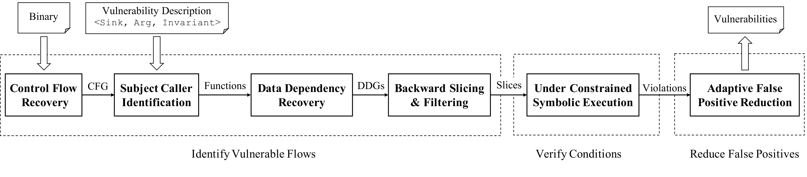

# Arbiter

Arbiter is a combination of static and dynamic analyses, built on top of angr, that can be used to detect some vulnerability classes.

All you need to use Arbiter is a sink that can be identified statically (like a call to a specific function), and a property that should not be violated at this sink.
Arbiter can then be used to detect if this property is violated at any of the corresponding sinks in the binary.


# Overview



# Research paper
We present our approach and the findings of this work in the following research paper:

**Arbiter: Bridging the Static and Dynamic Divide in Vulnerability Discovery on Binary Programs**

Jayakrishna Vadayath, Moritz Eckert, Kyle Zeng, Nicolaas Weideman, Gokulkrishna Praveen Menon, Yanick Fratantonio, Davide Balzarotti, Adam Doupé, Tiffany Bao, Ruoyu Wang, Christophe Hauser and Yan Shoshitaishvili

*In Proceedings of USENIX Security Symposium August 2022,*

If you use Arbiter in a scientific publication, we would appreciate citations using the following **Bibtex** entry:

```
@inproceedings {vadayath_arbiter_22,
	title        = {{Arbiter: Bridging the Static and Dynamic Divide in Vulnerability Discovery on Binary Programs}},
	author       = {Vadayath, Jayakrishna and Eckert, Moritz and Zeng, Kyle and Weideman, Nicolaas and Menon, Gokulkrishna Praveen and Fratantonio, Yanick and Balzarotti, Davide and Doup{\'e}, Adam and Bao, Tiffany and Wang, Ruoyu and Hauser, Christophe and Shoshitaishvili, Yan}
	booktitle    = {31st USENIX Security Symposium (USENIX Security 22)},
	month        = aug,
	year         = 2022,
	address      = {Boston, MA},
}
```


[Paper](https://jkrshnmenon.github.io/assets/pdf/arbiter_paper.pdf)


[Slides](https://jkrshnmenon.github.io/assets/pdf/arbiter_slides.pdf)


# Installation
Note: Run if you intend to run outside of a docker image otherwise you can skip this step  

`sudo python setup.py build && python setup.py install`


# Docker image

Note: This program was executed using the ubuntu subsytem for windows  


`docker pull 4rbit3r/arbiter:latest`

The coommand below will build and start the docker image  

`make run`

# Running Arbiter
The following commands will work both in the docker image or if you are running outside of a container with the proper install   


The command below will run all vuln templates against a given binary and save the logs  

`./runall_all_vuln_templates.sh target_binary ./logs`  


`python ./vuln_templates/run_aribter.py -f vuln_template -t target`  


Note: This is the simpliest way to run arbiter. Passing -h will show other arguements

# Arbiter examples

This repository contains some examples of using Arbiter to detect different CWE types in the `examples` directory.


It also contains templates that were used for evaluating Arbiter on the Juliet Test suite as well as real world binaries in the `vuln_templates` directory.
